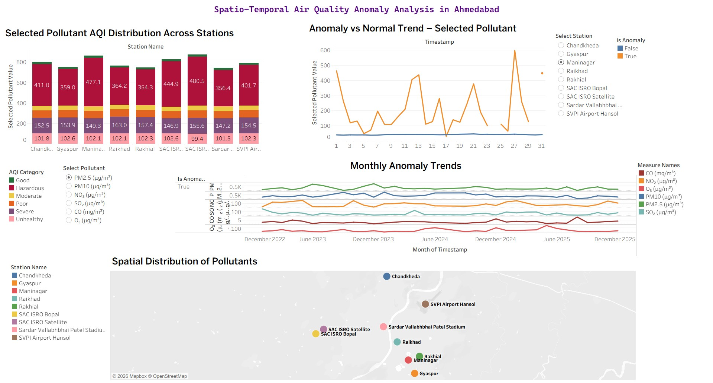
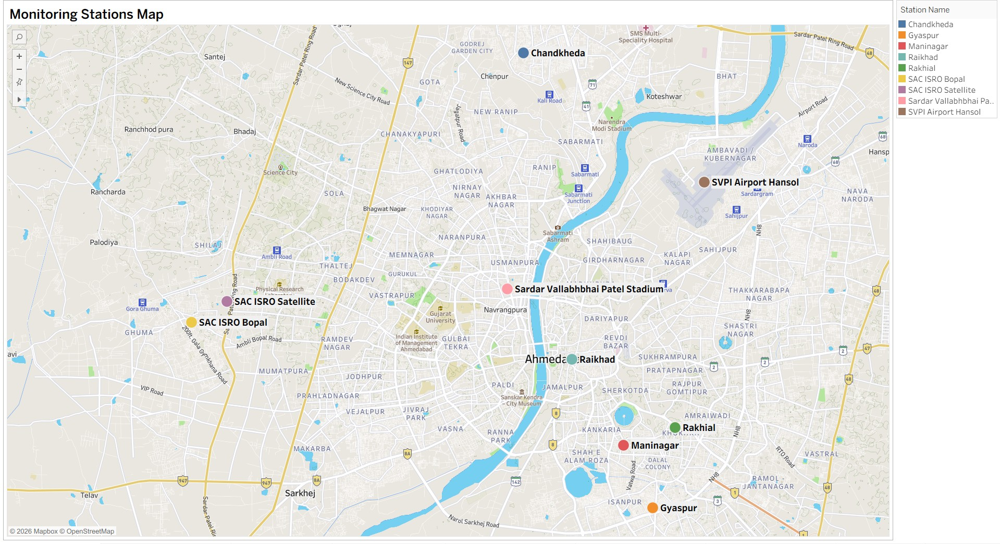
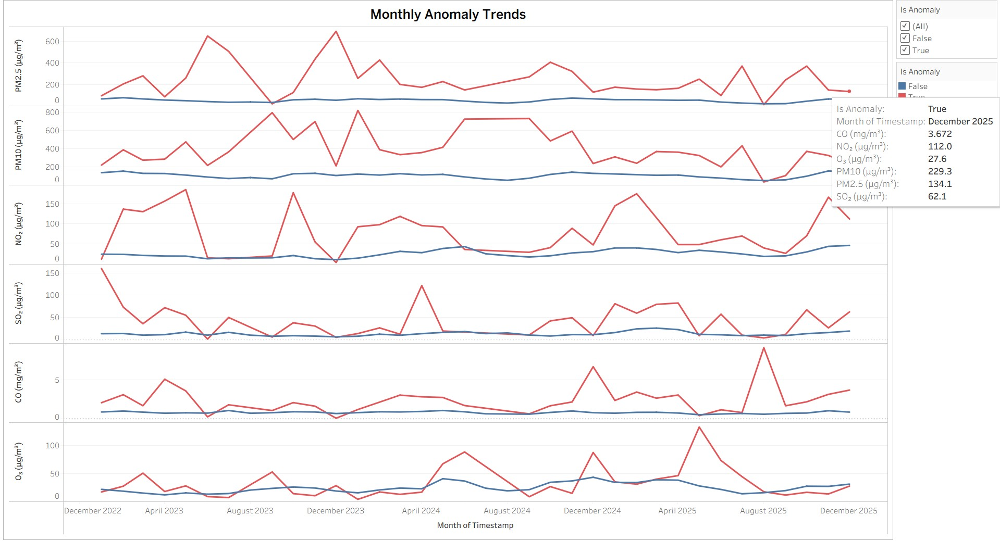
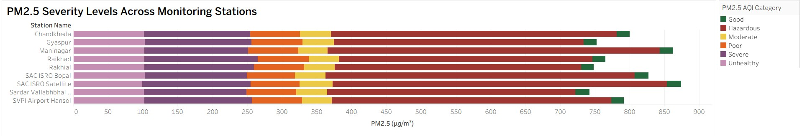

<div align="center">

# 🌍 Environmental Anomaly Detection using DBSCAN

### Detecting Air Quality Outliers through Spatio-Temporal Clustering & Environmental Analytics

[](https://www.python.org/)
[](https://pandas.pydata.org/)
[](https://numpy.org/)
[](https://scikit-learn.org/)
[](https://plotly.com/)
[](https://www.tableau.com/)
[](https://jupyter.org/)
[]()
[]()
[]()
[]()

### 📍 Location

Ahmedabad, Gujarat, India

### 📅 Dataset Period

2023 – 2025

### 🔗 Project Website

https://sites.google.com/view/qrlandingpage/home

</div>

---

# 🌟 Project Overview

Air pollution monitoring generates massive volumes of environmental data that often contain hidden patterns and unusual events. Identifying these anomalies manually is challenging and time-consuming.

This project applies **DBSCAN (Density-Based Spatial Clustering of Applications with Noise)** to detect environmental anomalies in Ahmedabad's air quality data. By analyzing spatial and temporal pollution patterns, the system identifies abnormal observations such as pollution spikes, unusual AQI values, pollution hotspots, and environmental outliers.

The project includes data preprocessing, anomaly detection, interactive visualizations, and Tableau dashboards for comprehensive environmental analysis.

---

# 🎯 Objectives

* Analyze Ahmedabad air quality data from 2023–2025.
* Detect environmental anomalies using DBSCAN clustering.
* Identify pollution hotspots and unusual pollution events.
* Study hourly and daily pollution trends.
* Perform spatio-temporal environmental analysis.
* Visualize anomaly patterns through interactive dashboards.
* Support data-driven environmental monitoring and decision-making.

---

# 🛠️ Technology Stack

| Category                | Technologies                |
| ----------------------- | --------------------------- |
| Programming             | Python                      |
| Data Analysis           | Pandas, NumPy               |
| Machine Learning        | Scikit-Learn (DBSCAN)       |
| Visualization           | Matplotlib, Seaborn, Plotly |
| Dashboarding            | Tableau                     |
| Development Environment | Jupyter Notebook            |

---

# 📂 Dataset Information

| Dataset              | Description                                                                                   |
| -------------------- | --------------------------------------------------------------------------------------------- |
| `final_data.csv`     | Hourly air quality observations collected from Ahmedabad monitoring stations                  |
| `pollution_data.csv` | Daily aggregated air quality measurements used for trend analysis                             |
| `ahd_dbscan.csv`     | Cleaned, transformed, and scaled dataset used for DBSCAN clustering and Tableau visualization |

---

# 📊 Dataset Features

| Feature                   | Description                                                                                        |
| ------------------------- | -------------------------------------------------------------------------------------------------- |
| **PM2.5**                 | Fine particulate matter with diameter ≤ 2.5 µm, capable of penetrating deep into the lungs         |
| **PM10**                  | Particulate matter with diameter ≤ 10 µm, generated from dust, construction, and vehicle emissions |
| **NO₂**                   | Nitrogen Dioxide, mainly emitted from vehicles and industrial activities                           |
| **SO₂**                   | Sulfur Dioxide, produced primarily from fossil fuel combustion                                     |
| **CO**                    | Carbon Monoxide, a harmful gas resulting from incomplete fuel combustion                           |
| **O₃**                    | Ground-level Ozone formed through atmospheric chemical reactions                                   |
| **AQI**                   | Air Quality Index representing overall pollution levels                                            |
| **Monitoring Station**    | Name or identifier of the air quality monitoring station                                           |
| **Latitude**              | Geographic latitude coordinate of the monitoring station                                           |
| **Longitude**             | Geographic longitude coordinate of the monitoring station                                          |
| **Timestamp Information** | Date and time of measurement used for temporal analysis                                            |

---

# ⚙️ Methodology

## 1️⃣ Data Collection

Environmental and air quality data were collected from monitoring stations across Ahmedabad.

## 2️⃣ Data Preprocessing

* Missing value handling
* Data cleaning
* Feature engineering
* Feature scaling
* Temporal aggregation
* Spatial data preparation

## 3️⃣ DBSCAN Clustering

DBSCAN was applied to group environmentally similar observations based on density.

### Parameters Used

| Parameter     | Description                                     |
| ------------- | ----------------------------------------------- |
| `eps`         | Neighborhood radius                             |
| `min_samples` | Minimum observations required to form a cluster |

Observations that do not belong to any cluster are labeled as **Noise (-1)** and treated as anomalies.

## 4️⃣ Environmental Anomaly Detection

Detected anomalies include:

* AQI Outliers
* Pollution Spikes
* Rare Environmental Events
* Spatial Pollution Hotspots
* Temporal Deviations

## 5️⃣ Visualization & Analysis

Results were visualized using:

* Matplotlib
* Seaborn
* Plotly
* Tableau Dashboards

---

# 📊 Key Results

The DBSCAN model successfully identified several environmental anomalies that were not easily visible through traditional analysis.

### Findings

✅ High AQI Spike Events

✅ Pollution Hotspots

✅ Temporal Environmental Outliers

✅ Unusual Pollutant Concentrations

✅ Noise Points Representing Potential Anomalies

These findings demonstrate the effectiveness of density-based clustering for environmental anomaly detection.

---

# 📈 Dashboard Visualizations

The Tableau dashboard provides:

* AQI Monitoring
* Station-wise Pollution Analysis
* Monthly Anomaly Trends
* PM2.5 Severity Analysis
* Geographic Pollution Mapping
* Cluster Visualization

### Dashboard Screenshots

#### 🏠 Main Dashboard


#### 🗺️ Monitoring Station Map


#### 📊 Monthly Anomaly Trends



#### 📍 Average PM2.5 by Station


---

# ⚡ Installation Guide

## Clone Repository

```bash
git clone https://github.com/anmol396/Environmental-Anomaly-Detection-DBSCAN.git
cd Environmental-Anomaly-Detection-DBSCAN
```

## Create Virtual Environment

```bash
python -m venv venv
```

## Activate Environment

```bash
# Windows
venv\Scripts\activate

# Linux / macOS
source venv/bin/activate
```

## Install Dependencies

```bash
pip install -r requirements.txt
```

## Launch Jupyter Notebook

```bash
jupyter notebook
```

Open:

* `Hourly_DBSCAN_Anomaly_Analysis.ipynb`
* `Daily_DBSCAN_Anomaly_Analysis.ipynb`

---

# 📁 Project Structure

```text
Environmental-Anomaly-Detection-DBSCAN/
│
├── data/
│   ├── final_data.csv
│   ├── pollution_data.csv
│   └── ahd_dbscan.csv
│
├── notebooks/
│   ├── Hourly_DBSCAN_Anomaly_Analysis.ipynb
│   └── Daily_DBSCAN_Anomaly_Analysis.ipynb
│
├── dashboard/
│   └── Spatio-Temporal Air Quality Anomaly Analysis in Ahmedabad.twbx
│
├── images/
│   ├── dashboard.jpg
│   ├── MapView_of_Stations.jpg
│   ├── Monthly_Anomaly_Trends.jpg
│   ├── PM2.5_Severity.jpg
│   └── avg_PM2.5_by_station.jpg
│
├── README.md
├── requirements.txt
└── LICENSE
```

---

# 📦 Requirements

```txt
pandas
numpy
scikit-learn
matplotlib
seaborn
plotly
jupyter
ipykernel
scipy
```

---

# 🌎 Applications

* Smart City Monitoring
* Environmental Surveillance
* Pollution Event Detection
* Public Health Research
* Urban Sustainability Planning
* Environmental Risk Assessment
* Air Quality Monitoring Systems

---

# 🔮 Future Enhancements

* Real-Time Anomaly Detection
* IoT Sensor Integration
* Live AQI Monitoring Dashboard
* Predictive Air Quality Forecasting
* Isolation Forest-Based Detection
* Deep Learning-Based Anomaly Detection
* Automated Alert & Notification System

---

# 📜 License

This project is developed for educational, research, and environmental analytics purposes.

Feel free to fork, explore, and enhance the project for academic or real-world environmental monitoring applications.

---

<div align="center">

⭐ If you found this project useful, consider giving it a star!

</div>
